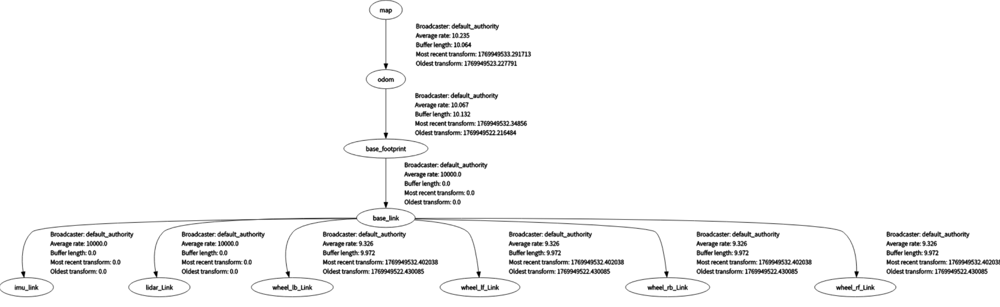
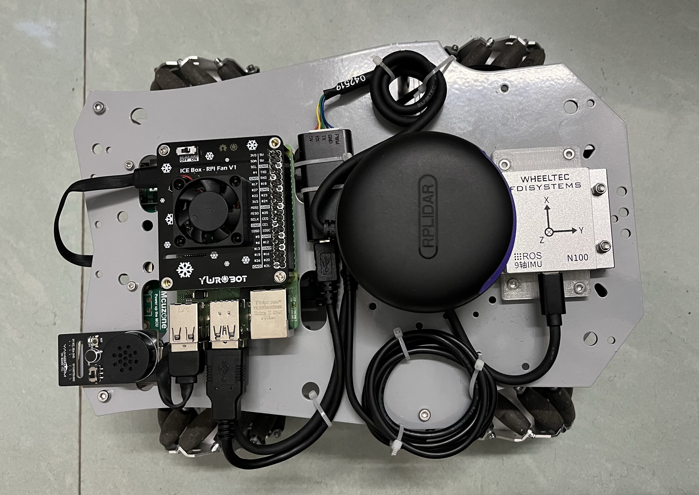
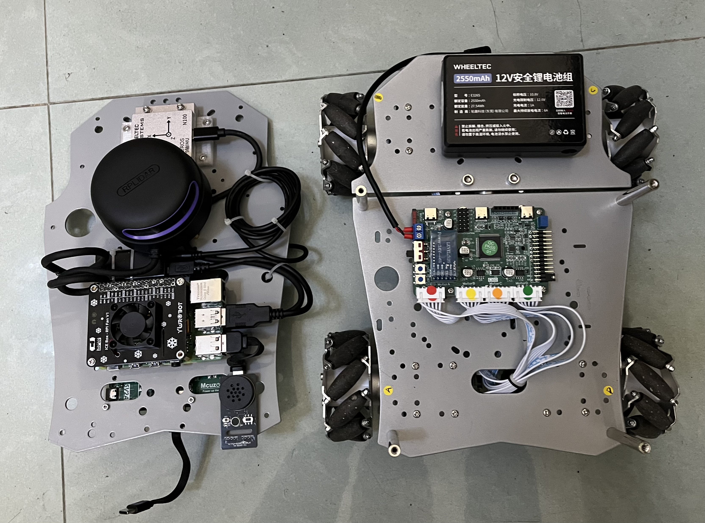

# 基于ROS2的激光SLAM麦轮导航小车项目实战
## 1.项目介绍
本项目适合新手动手实现SLAM建图和导航功能，基于鱼香ROS的学习视频，在第六章或第七章同步学习中，可根据本项目进行实践，会加速你对ROS2框架与导航实践的理解和应用。
## 2.使用说明
可结合本人blibli此系列视频进行操作，视频链接：[14天怒搓SLAM导航小车](https://www.bilibili.com/video/BV1s2zMBhE6D?vd_source=956043e91d9fa045c1e7c746411b5102)
### 2.1⚙️所需硬件
- 主控：树莓派4B（建议8GB以上内存或高性能兼容ROS2的设备）
- 雷达：思岚A2M12
- IMU：轮趣科技N100
- 语音模块：亚博智能Cl1302
- 小车底盘：轮趣科技L150 PRO麦轮(已含STM32及驱动)
- 注：以上硬件设备不满足可修改代码进行微调替换，用MobaXterm进行ssh连接树莓派4B，win下的cmd或powershell等终端ssh工具无法返回vscode或rviz图像，高性能设备可自行配置VNC服务器进行远程连接。
### 2.2安装依赖与编译项目
本项目依赖较多，若在安装过程中遇到问题，请在B站视频下方留言(**以下串口均为绝对ID，无需担心串口插拔顺序问题，自行保证串口读写权限，加入到dialout组**)。  

| 文件夹📂📂📂 | 主要功能🔔🔔🔔 |
|-----------|---------------|
| mc_ws | 麦轮底盘控制系统 |  
| radar_ws | 激光雷达驱动 |
| urdf_mac_ws | 机器人URDF模型 |
| imu_ws + imu_tools_catkin_ws | IMU传感器和滤波 |
| slam_nv2_ws | SLAM建图和导航系统 |
| stm32 | 底层硬件控制固件 |
1. 克隆代码仓库
```bash
cd ~ && git clone git@github.com:Luckme921/ROS_SLAM.git
```
2. 雷达：A2M12 (注意安装方向)
```bash
ls /dev/serial/by-id/
```
- 看到雷达设备ID后，修改radar_ws下的src/launch/view_rplidar_a2m12_launch.py文件和rplidar_a2m12_launch.py文件，将其中的/dev/ttyUSB0修改为/dev/serial/by-id/你的雷达设备ID
- 执行以下命令编译运行项目
```bash
cd ~/ROS_SLAM/radar_ws
colcon build --symlink-install
echo "source ~/ROS_SLAM/radar_ws/install/setup.bash --extend" >> ~/.bashrc
source ~/.bashrc
cd ~/ROS_SLAM
sudo cp -r rplidar.rules /etc/udev/rules.d/
ros2 launch rplidar_ros view_rplidar_a2m12_launch.py
```
3. URDF模型(ROS_SLAM文件下的陀螺仪转接件STL，需自行3D打印制作)  
- urdf_mac_ws/src/urdf_show/meshes为SW生成的STL文件，meshes同级config_rviz为rviz默认配置文件保存路径
```bash
sudo apt install ros-humble-robot-state-publisher -y
sudo apt install ros-humble-joint-state-publisher -y
cd ~/ROS_SLAM/urdf_mac_ws
colcon build --symlink-install
echo "source ~/ROS_SLAM/urdf_mac_ws/install/setup.bash --extend" >> ~/.bashrc
source ~/.bashrc
ros2 launch urdf_show robot_display_launch.py
ros2 launch urdf_show robot_with_lidar_launch.py
```
4. IMU：N100(注意安装方向)  
- 可根据N100资料，编写单个Python测试脚本，提前测试IMU数据读取与解析
```bash
ls /dev/serial/by-id/
```
- 看到IMU设备ID后，修改imu_ws下的src/imu_driver/imu_driver/imu_node.py文件，将其中的/dev/ttyUSB0修改为/dev/serial/by-id/你的IMU设备ID
- 执行以下命令编译运行项目
```bash
cd ~/ROS_SLAM/imu_ws
colcon build --symlink-install
echo "source ~/ROS_SLAM/imu_ws/install/setup.bash --extend" >> ~/.bashrc
source ~/.bashrc
ros2 run imu_driver imu_driver_node
ros2 topic echo /imu/data_raw
```
- 请提前安装imu_node.py中python依赖,之后打开新的终端，编译官方imu_tools_catkin_ws下的代码
```bash
sudo apt-get install ros-<你的ros版本>-imu-tools
cd ~/ROS_SLAM/imu_tools_catkin_ws
colcon build
echo "source ~/ROS_SLAM/imu_tools_catkin_ws/install/setup.bash --extend" >> ~/.bashrc
source ~/.bashrc
ros2 launch imu_complementary_filter complementary_filter.launch
ros2 topic echo /imu/data
```
- 即可看到经过imu_tools滤波后的IMU数据，参考网址：[imu_tools](https://github.com/CCNYRoboticsLab/imu_tools)
- 以下为编写IMU开机自启脚本，使用者也可自行在launch文件中添加IMU节点，跳过此步骤
```bash
cd ~/ROS_SLAM/imu_ws
touch run_imu_node.sh
nano run_imu_node.sh
```
- 复制以下内容到run_imu_node.sh文件中
```bash
#!/bin/bash
# 等待系统网络和ROS2环境就绪
sleep 5
# 加载ROS2基础环境
source /opt/ros/humble/setup.bash
# source工作空间
source /home/pi/ROS_SLAM/imu_ws/install/setup.bash
# 运行IMU节点
ros2 run imu_driver imu_node > /home/pi/imu_node.log 2>&1
```
- 后添加执行权限，并创建服务文件
```bash
sudo chmod +x ./run_imu_node.sh
sudo nano /etc/systemd/system/imu_node.service
```
- 复制以下内容到imu_node.service文件中
```bash
[Unit]
Description=IMU Driver Node Auto Start
After=network.target multi-user.target
Wants=network.target

[Service]
Type=simple
User=pi（根据实际用户名修改）
WorkingDirectory=/home/用户名/ROS_SLAM/imu_ws
ExecStart=/home/用户名/ROS_SLAM/imu_ws/run_imu_node.sh
Restart=on-failure
RestartSec=5

[Install]
WantedBy=multi-user.target
```
- 设置开机自启动服务并查看状态
```bash
sudo systemctl daemon-reload
sudo systemctl enable imu_node.service
sudo systemctl start imu_node.service
sudo systemctl status imu_node.service #确保输出服务状态为active（running）
ros2 topic echo /imu/data_raw #查看IMU原始数据是否正常
```
5. ⭐⭐⭐mc_ws重要代码文件📸  


- STM32串口1，语音模块Cl1302串口模式提前连接。
```bash
ls /dev/serial/by-id/
```
- 看到STM32串口设备ID后，修改mc_ws下的src/mc_chassis/mc_chassis/serial_comm_node.py文件，将其中的/dev/ttyUSB0修改为/dev/serial/by-id/你的STM32串口设备ID  
- 看到Cl1302设备ID后，修改mc_ws下的src/mc_chassis/mc_chassis/sound_node.py文件，将其中的/dev/ttyUSB0修改为/dev/serial/by-id/你的Cl1302设备ID  
- 修改launch文件夹下的两个文件（区别在有无rviz显示），保证你的串口设备ID与imu_tools滤波的launch启动路径正确（用户也可自行修改代码用其他启动逻辑）
```bash
cd ~/ROS_SLAM/mc_ws
colcon build --symlink-install
echo "source ~/ROS_SLAM/mc_ws/install/setup.bash --extend" >> ~/.bashrc
source ~/.bashrc
```
- 这个launch文件会启动STM32串口通信节点、语音模块节点、IMU滤波节点、雷达节点、URDF模型显示节点等。原IMU节点开机自动启动，无需额外操作
```bash
ros2 launch mc_chassis text.launch.py
```
- 打开新终端，输入以下命令启动键盘控制节点：(STM32代码需先编译上传，后可正确运动，否则小车无反应)
```bash
ros2 run mc_chassis cmd_vel_keyboard.py
```
- 打开新终端，输入以下命令启动语音控制节点：(可自行升级为语音导航节点)
```bash
ros2 run mc_chassis sound_vel.py
```
6. ⭐⭐⭐slam_nv2_ws重要代码文件,主要流程可参考鱼香ROS2第7、8章节视频  
- src文件夹下controller文件夹为自定义的控制节点，planner文件夹为自定义的规划节点
- slam_nv2下的config文件夹为控制器和规划器等参数的配置文件，maps下为地图文件，params.yaml为建图参数配置文件(默认不带IMU建图，若要带IMU建图，可选lds_2dcopy.lua文件作为cartographer启动launch的选择文件)。launch下cartographer_launch为建图启动文件，会接收/scan、/imu/data、/odom话题数据，发布/map等话题
- 首先编译工程，安装Cartographer
```bash
cd ~/ROS_SLAM/learn_pluginlin
sudo apt install ros-humble-pluginlib -y
colcon build --symlink-install
source install/setup.bash
ros2 run motion_control_system test_plugin motion_control_system/SpinMotionController
cd ~/ROS_SLAM/slam_nv2_ws
colcon build --symlink-install
echo "source ~/ROS_SLAM/slam_nv2_ws/install/setup.bash --extend" >> ~/.bashrc
source ~/.bashrc
wget http://fishros.com/install -O fishros && . fishros
```
- 输入9，安装Cartographer  
- 用户需要先运行:
```bash
ros2 launch mc_chassis text.launch.py
```
- 启动cartographer_launch建图，rviz中选择map话题
```bash
ros2 launch slam_nav2 cartographer_launch.py
```
- 启动键盘控制节点或语音控制节点，遥控小车建图
```bash
ros2 run mc_chassis cmd_vel_keyboard.py
```
- 建图完成后，用户需要在指定路径保存地图，后续进行导航
- 安装地图保存插件nav2_map_server:
```bash
sudo apt install ros-humble-nav2-map-server -y
ros2 run nav2_map_server map_saver_cli -f ~/ROS_SLAM/slam_nv2_ws/src/slam_nav2/maps/room1
```
- 安装nav2启动实例功能包nav2_bringup:
```bash
sudo apt install ros-humble-nav2-bringup -y
```
- 启动导航功能，以下launch会启动自定义导航控制规划节点、雷达、Rviz2可视化工具等，自定义规划控制算法更改可参考鱼香ROS第8章节视频
```bash
ros2 launch slam_nav2 slam_nv2_launch.py
```
- TF树可视化  
  

7. stm32.zip
- 包含STM32代码，需先烧录，stm32/a/OBJ/WHEELTEC.hex，后可正确运动，否则小车无反应
- stm32发送数据格式：
```
{A[左后速度]:[左前速度]:[右前速度]:[右后速度]:[整体实时速度]}$
```
- 例如，当四个麦轮速度分别为200、200、200、200（单位：mm/s），整体实时速度为200（单位：mm/s），则发送数据为：
```
{A200:200:200:200:200}$
```
- stm32串口1接收的命令及执行动作
```bash
X: 加速（步长10mm/s）
Y: 减速（步长10mm/s）
K: 转向模式（原地转向模式切换）
I: 移动模式（前后左右平移模式）
J: 移动模式（前后左右平移模式）
Z: 停止
A: 前进
B: 前进右45°（只在移动模式下有效）
C: 右移或右转（转向模式右转，移动模式右移）
D: 后退右45°（只在移动模式下有效）
E: 后退
F: 后退左45°（只在移动模式下有效）
G: 左移或左转（转向模式左转，移动模式左移）
H: 左前进45°（只在移动模式下有效）
```
- 速度设置命令（初始默认速度200mm/s，最大速度1000mm/s，最小速度0）
```bash
命令格式  {0xxxx}
执行动作  设置速度为xxxx mm/s（例如{01000}表示1000mm/s）
```
- 注意：设置目标速度时、加减速度XY指令发送时，小车会暂停。频繁设置速度或加减速会导致小车卡顿，下发的cmd_vel速度数据会被底盘控制节点速度过滤：速度波动5mm/s不执行加减速指令或速度设置指令，可在代码中更改过滤参数
### 2.3实物图片📸 📸 
- 正上  
  
  
## 3.📩作者
- [Luckme921](https://github.com/Luckme921)

- **邮箱**：1814313359@qq.com
